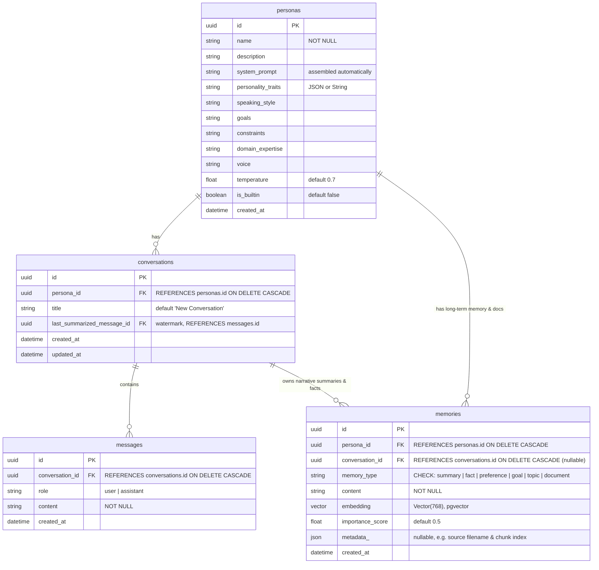

# 🗄️ Database Schema and Migrations

This document details the database tables, fields, relationships, and migration configurations. It also explains how the `pgvector` extension is integrated for semantic search capabilities.

---

## 🏛️ Entity-Relationship Diagram (ERD)

The database schema represents a hierarchical structure starting from **Personas** down to individual **Conversations** and **Messages**, with **Memories** connected at the Persona level for custom knowledge-bases, and at the Conversation level for session-specific context:



---

## 📋 Table Definitions

### 1. `personas` Table
Maps to the [Persona](file:///c:/Users/loq/Desktop/learn/personas/app/models/persona.py) model.
- Storehouse for agent configurations. Custom configurations are assembled into `system_prompt` by the backend.
- `is_builtin`: Distinguishes core personas (read-only) from user-created ones.

### 2. `conversations` Table
Maps to the [Conversation](file:///c:/Users/loq/Desktop/learn/personas/app/models/conversation.py) model.
- Scopes a sequence of message turns between the user and a persona.
- `last_summarized_message_id`: Watermark tracker denoting the last message integrated into a rolling context summary.

### 3. `messages` Table
Maps to the [Message](file:///c:/Users/loq/Desktop/learn/personas/app/models/message.py) model.
- Log of the dialogue turns. Sorted chronologically via `created_at` for assembling active short-term chat history.

### 4. `memories` Table
Maps to the [Memory](file:///c:/Users/loq/Desktop/learn/personas/app/models/memory.py) model.
- Relies on PostgreSQL's `pgvector` to house embeddings.
- Columns:
  - `memory_type`: CHECK constraint limiting entries to `summary` (rolling session narratives), `fact` (discrete user attributes), `document` (chunks of uploaded RAG documents), `preference`, `goal`, or `topic`.
  - `embedding`: Vector datatype with exactly **768 dimensions** matching the shape produced by the `text-embedding-004` model.
  - `metadata_`: Mapped SQLAlchemy JSON column. Used during document uploads to store source markers:
    ```json
    { "source": "deepmind_rules.txt", "chunk_index": 4 }
    ```

---

## 🐘 The `pgvector` Configuration & Migrations

For PostgreSQL to handle vector types and perform distance metrics, the `vector` database extension must be activated.

### ⚠️ Migration Loading Order
In Alembic, auto-generated migrations do not automatically add the SQL commands to enable database extensions. If a migration tries to create a column of type `vector` before enabling the extension, PostgreSQL will throw a syntax error.

To resolve this, the migration script [eff19a00e7fa_add_memories_table.py](file:///c:/Users/loq/Desktop/learn/personas/app/alembic/versions/eff19a00e7fa_add_memories_table.py) was manually modified to run `op.execute("CREATE EXTENSION IF NOT EXISTS vector")` first.

```python
# app/alembic/versions/eff19a00e7fa_add_memories_table.py (excerpt)
def upgrade() -> None:
    # 1. MUST load vector extension first!
    op.execute("CREATE EXTENSION IF NOT EXISTS vector")
    
    # 2. Create the memories table
    op.create_table(
        'memories',
        sa.Column('id', sa.UUID(), nullable=False),
        sa.Column('persona_id', sa.UUID(), nullable=False),
        sa.Column('conversation_id', sa.UUID(), nullable=True),
        sa.Column('memory_type', sa.String(), nullable=False),
        ...
        sa.Column('embedding', pgvector.sqlalchemy.Vector(dim=768), nullable=True),
        ...
    )
```

---

## 🧪 Testing Isolation (Database Sandboxing)

To ensure that running tests does not corrupt your active development database, we implement a **zero-pollution testing pipeline**:

1. **Test Mode Detection**: `app/db.py` checks the environment variables:
   ```python
   is_testing = os.environ.get("TESTING", "false").lower() == "true"
   ```
2. **Pool Disabling**: When `is_testing` is True, SQLAlchemy engines are configured with `NullPool` to bypass persistent connection pooling, ensuring each connection is isolated.
3. **Transaction Rollbacks**: Inside [conftest.py](file:///c:/Users/loq/Desktop/learn/personas/app/tests/conftest.py), the database sessions for testing are wrapped in a nested transaction. Once the test finishes execution, the transaction is **rolled back** (`await session.rollback()`). This guarantees that no test data commits permanently to the disk, leaving the dev database clean.
