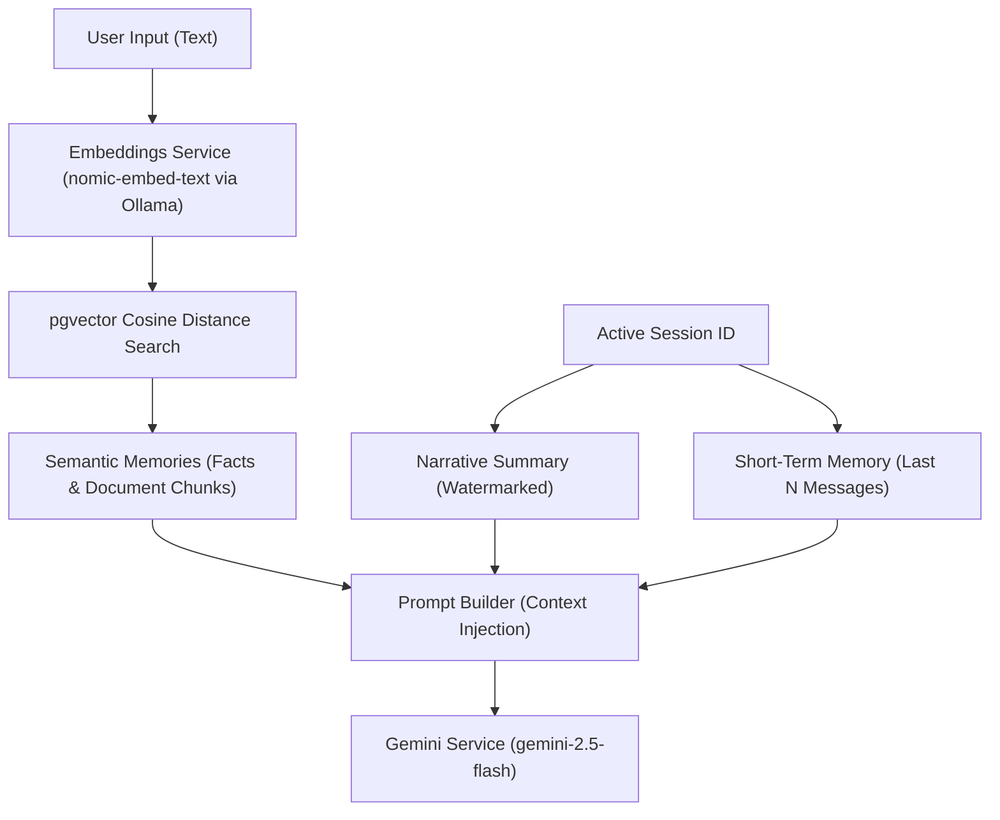

# 🧠 How RAG and Persistent Memory Work

This document explains the technical details, algorithms, and workflows behind the persistent memory layer and Retrieval-Augmented Generation (RAG) implementation.

---

## 🏛️ The Memory Architecture

The memory layer is split into **two tiers** that are assembled dynamically for every turn of a conversation:



---

## 1. Embeddings Generation

We use the local **`nomic-embed-text`** model via Ollama, which outputs a **768-dimension vector** for any input text.
- **Service**: [embeddings.py](file:///c:/Users/loq/Desktop/learn/personas/app/services/embeddings.py) wraps the async `httpx` call to Ollama's HTTP backend.
- **Format**: Floating-point array of length 768.
- **Storage**: Saved inside the `embedding` column of the `memories` table (which is mapped to the PostgreSQL `vector(768)` type via the `pgvector` SQLAlchemy extension).

---

## 2. Document Chunking & Ingestion (RAG)

When a text or markdown document is uploaded for a persona:
1. **Splitting**: We split the document into overlapping chunks using a **word-aligned sliding window** algorithm in [memory.py](file:///c:/Users/loq/Desktop/learn/personas/app/services/memory.py).
   - **Chunk size**: 500 characters.
   - **Overlap**: 100 characters.
   - **Constraint**: Chunks are split on word boundaries (spaces) to prevent cutting words in half.
2. **Embedding**: We generate embeddings for all chunks in a single batch request to minimize API latency.
3. **Storage**: The chunks are saved in the `memories` table:
   - `memory_type` = `'document'`
   - `metadata` = `{"source": "filename.txt", "chunk_index": i}`
   - `conversation_id` = `NULL` (this makes the knowledge base globally accessible to the persona across all sessions, rather than restricted to a single chat thread).

---

## 3. Semantic Retrieval & Cosine Similarity

To retrieve relevant context for a user's turn:
1. **Query Embedding**: The user's input (e.g., *"What is my favorite book?"*) is embedded.
2. **pgvector Query**: We run a cosine-distance search in PostgreSQL using the `<=>` cosine operator in SQL (accessed via `.cosine_distance()` in SQLAlchemy; note `<->` is L2/Euclidean, `<=>` is cosine):
   ```python
   distance = Memory.embedding.cosine_distance(query_embedding)
   stmt = (
       select(Memory)
       .where(Memory.persona_id == persona_id)
       .where(Memory.memory_type != "summary")
       .where(distance < 0.7)  # Cosine distance threshold
       .order_by(distance.asc())
       .limit(5)
   )
   ```
   - **Cosine Distance vs Cosine Similarity**: Cosine distance ranges from `0.0` (identical) to `2.0` (opposite). Cosine similarity is `1 - distance`.
   - **Threshold**: We apply a distance filter of `< 0.7` (equivalent to similarity `> 0.3`) to prevent injecting noise or irrelevant data.

---

## 4. Rolling Summarization (Rolling Context)

To prevent long chat threads from exceeding context limits or inflating token costs, we implement rolling summarization in [summarizer.py](file:///c:/Users/loq/Desktop/learn/personas/app/services/summarizer.py):

1. **Watermark**: The `conversations` table stores `last_summarized_message_id`.
2. **Trigger**: When the number of messages after the watermark exceeds `SUMMARIZE_THRESHOLD` (default: 10), summarization starts.
3. **Ollama Extraction**: We send the previous narrative summary and the new unsummarized messages to the local **`qwen3:8b`** model via Ollama's `/api/chat`.
   - **Structured Outputs**: We enforce a strict JSON schema using a Pydantic model (`SummaryOutput`) passed as `format` to the Ollama client:
     ```python
     class SummaryOutput(BaseModel):
         summary: str   # Narrative summary paragraph
         facts: list[str]  # Individual user facts extracted
     ```
4. **Persist & Index**:
   - The updated narrative summary is saved as a new `summary` memory.
   - Individual user facts (e.g. *"User owns a dog named Rusty"*) are batch-embedded and saved as `fact` memories (which can be semantically searched in future turns).
   - The conversation watermark `last_summarized_message_id` is updated to the last message of the block.

---

## 5. Prompt Assembly & Context Injection

Before sending a turn to Gemini, [prompt_builder.py](file:///c:/Users/loq/Desktop/learn/personas/app/services/prompt_builder.py) merges all contexts into a single system instruction block:

```
You are [Persona Name], [Description]...
PERSONALITY: ...
SPEAKING STYLE: ...

### LONG-TERM MEMORY & CONTEXT
Narrative Summary of Past Conversations:
  [Latest Rolling Summary content]

Extracted Facts & Uploaded Reference Materials:
  - User's favorite color is green (from Session 1 fact extraction)
  - [deepmind.txt]: Google DeepMind developed the Gemini series (from RAG Document upload)
```

This ensures that the LLM is fully aware of custom knowledge bases and long-term user preferences, and can reference them naturally in the chat.
