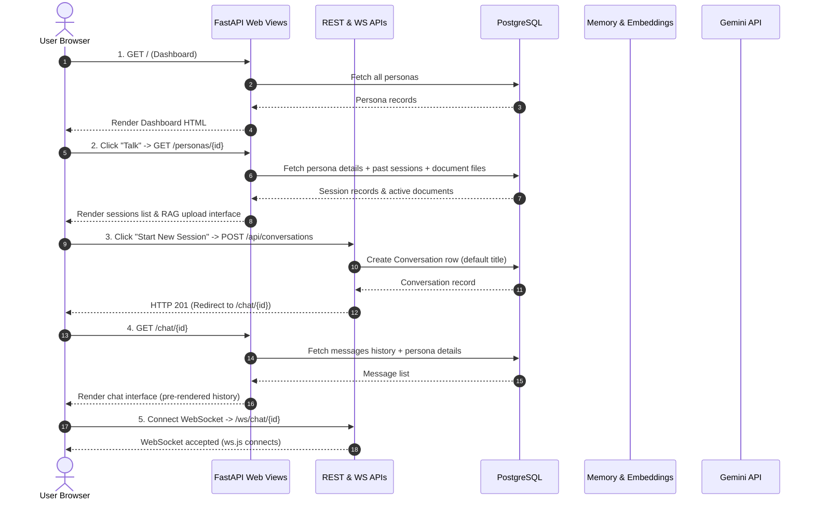
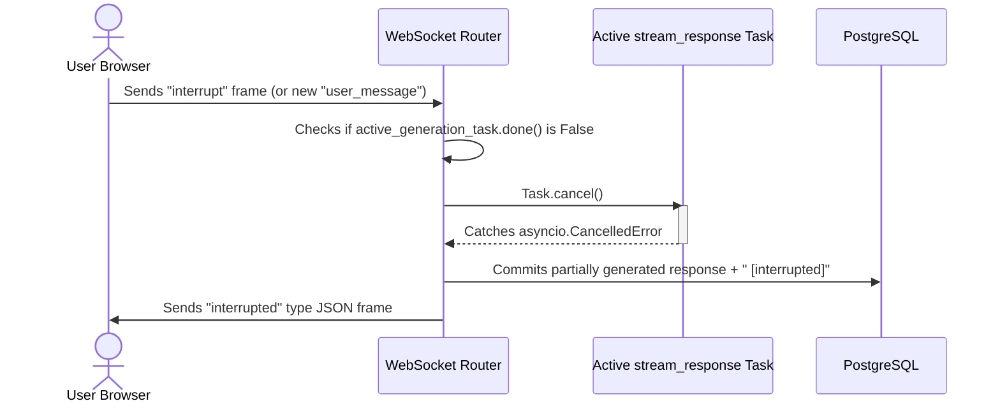

# 🏛️ System Walkthrough

This document traces the step-by-step lifecycle of a user session and a single chat message turn from the frontend UI through the backend services to the database and Gemini APIs. It also details real-time events like task cancellations and background processes.

---

## 🔁 User Flow & Requests Lifecycle

The diagram below shows how FastAPI serves initial views via Jinja2 templates, lists active sessions, and upgrades connections to WebSockets:



---

## 💬 The Real-Time Message Turn Loop

When a user types a message and clicks **Send** or triggers Speech-to-Text:

### 1. Client Event Transmission
- The JavaScript controller inside [ws.js](file:///c:/Users/loq/Desktop/learn/personas/app/static/js/ws.js) intercepts the chat form submission.
- It immediately appends a user chat bubble to the HTML DOM.
- It sets the UI status indicator to **Thinking**.
- It transmits a JSON payload over the open WebSocket:
  ```json
  { "type": "user_message", "text": "Who is the lead researcher at DeepMind?" }
  ```

### 2. WebSocket Server Connection Ingestion
- The WebSocket handler inside [voice_ws.py](file:///c:/Users/loq/Desktop/learn/personas/app/api/voice_ws.py) intercepts the frame.
- If there is already an active generation task running for this session, the server cancels it immediately (see "Barge-in / Interruptions" below).
- The handler spawns an asynchronous background task `stream_response` to process the query.
- **Save User Turn**: The task creates a new `Message` row in the database with `role = 'user'` and commits it, updating the conversation's `updated_at` timestamp.

### 3. Context Retrieval & RAG Query Pipeline
- The system calls `MemoryService.retrieve_context(...)` inside [memory.py](file:///c:/Users/loq/Desktop/learn/personas/app/services/memory.py):
  1. **Narrative Summary Loading**: It pulls the latest rolling session summary from the database (if it exists) to establish historical conversation memory.
  2. **Query Embedding**: The user's input string is embedded using the `EmbeddingsService` with the `text-embedding-004` model.
  3. **Vector Distance Match**: The vector is queried against the `memories` table using the `<->` cosine distance operator in PostgreSQL. The system filters by `distance < 0.7` and limits results to 5 matches.
  4. **System Instruction Assembly**: The retrieved documents and summaries are formatted and injected into the persona's base system prompt inside [prompt_builder.py](file:///c:/Users/loq/Desktop/learn/personas/app/services/prompt_builder.py).

### 4. Short-Term History Map
- The database is queried for the last `SHORT_TERM_MESSAGES - 1` messages (default: 11 messages) in the thread to provide immediate dialog history.
- The system maps these records into a list of Gemini `types.Content` objects to preserve context.

### 5. Asynchronous Streaming Generation
- The server calls `GeminiService.generate_chat_stream(...)` inside [gemini.py](file:///c:/Users/loq/Desktop/learn/personas/app/services/gemini.py).
- This service invokes the `Client.aio.models.generate_content_stream` method in the `google-genai` SDK.
- As tokens arrive from Google's servers, the event loop yields them and writes them to the WebSocket:
  ```json
  { "type": "token", "delta": "Google " }
  { "type": "token", "delta": "DeepMind's " }
  ```

### 6. Client Rendering & Playback
- [ws.js](file:///c:/Users/loq/Desktop/learn/personas/app/static/js/ws.js) receives the first token, builds an assistant chat bubble, sets the UI state to **Streaming**, and appends the text chunk.
- Subsequent tokens are appended to the bubble in real time, and the scroll container is scrolled to the bottom.

### 7. Turn Finalization
- Once the model stream concludes, the server commits the completed response as an assistant `Message` in the database.
- It sends a concluding frame to the client:
  ```json
  { "type": "message_complete", "message_id": "<uuid>", "text": "Google DeepMind's lead is..." }
  ```
- The client resets the UI to **Idle** and re-enables inputs.

---

## 🛑 Barge-in & Generation Interruptions

A key requirement of voice-agent platforms is **barge-in support**: if the assistant is speaking/generating and the user speaks or clicks "Stop/Interrupt", the assistant must immediately cease execution.



### 1. Client Interrupt Trigger
- The user clicks the **Interrupt** button (or speaks while the system is generating).
- The client sends an `interrupt` message or a new `user_message` type packet.

### 2. Server Cancellation
- Inside [voice_ws.py](file:///c:/Users/loq/Desktop/learn/personas/app/api/voice_ws.py), the main receive loop checks if `active_generation_task` exists and is not finished.
- It calls `active_generation_task.cancel()`.
- The event loop raises an `asyncio.CancelledError` inside the `stream_response` task execution path.

### 3. Graceful Database & Client Commits
- The `except asyncio.CancelledError:` block catches the cancellation.
- If the model had already streamed partial tokens (e.g., *"Google Deep"*), this partial text is appended with a suffix ` [interrupted]` and saved to the database.
- The server sends a final frame to the client:
  ```json
  { "type": "interrupted", "text": "Google Deep [interrupted]" }
  ```
- This ensures that conversational context matches what the user actually heard before interrupting.

---

## ⚡ Background Tasks Scheduling (Async Summarizer)

Calculating rolling summaries and generating vector embeddings are expensive operations. If done inline, they would block the real-time WebSocket connection, causing latency spikes.

To prevent this:
1. At the end of a successful generation, the WebSocket server triggers the summarizer using **`asyncio.create_task`**:
   ```python
   # Inside stream_response:
   asyncio.create_task(summarizer_service.maybe_summarize(conversation_id))
   ```
2. `asyncio.create_task` schedules the coroutine `maybe_summarize` to run on FastAPI's active event loop. It does not await it, returning control to the caller immediately.
3. The WebSocket connection completes the turn and goes back to waiting for user inputs, while the event loop handles database lookups, calls Gemini, generates vector embeddings, and writes summaries in the background.
4. If a client disconnects during background processing, Uvicorn catches the disconnect safely. The `voice_ws.py` connection wrapper uses a `try...finally` block to cancel the active generation task to avoid leaking resources.
